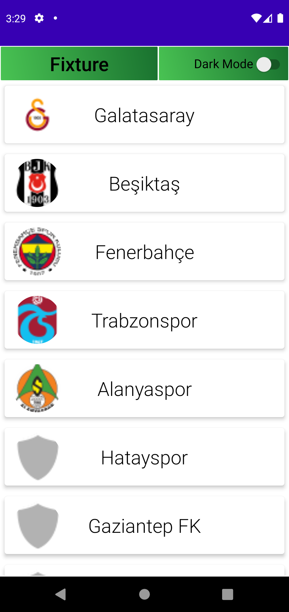
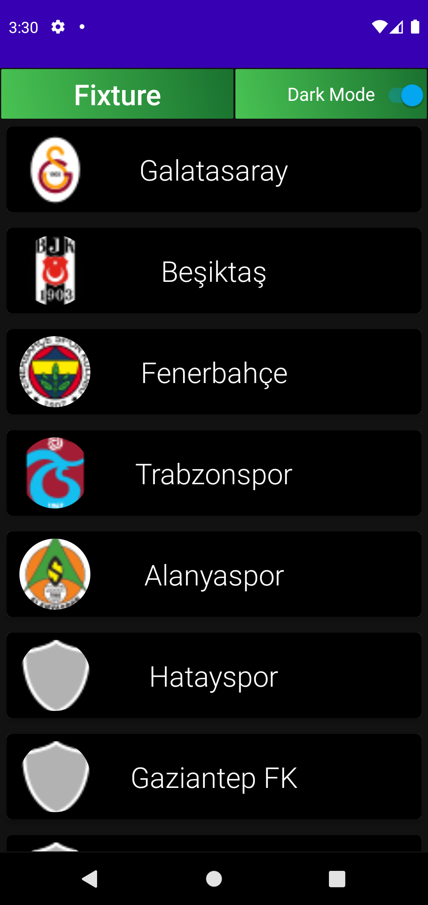

# HuaweiMobileServicesAssignment
news
# Architecture

- MVVM
 
# Libraries

- Retrofit2/Gson
- RxJava2
- Live Data
- Navigation
- Glide
- Intuit
- Animation

    
     
      
     
      
     
      
     
      
     
      
     
      
     
      
     
      
     
      
     
      
     
      
     
      
     
      
     
     
      
     
      
     
      
     
      
     
      
     
      
     
      
     
      
     
      
     
      
     
      
     
      
     
      
     
      
     
     

